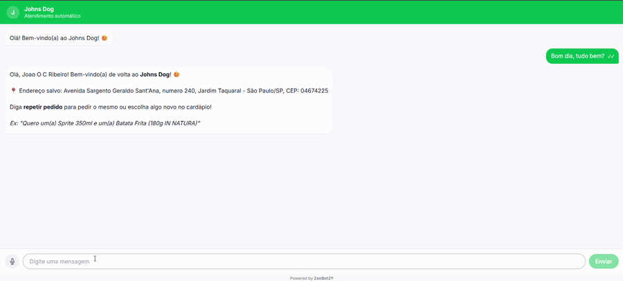
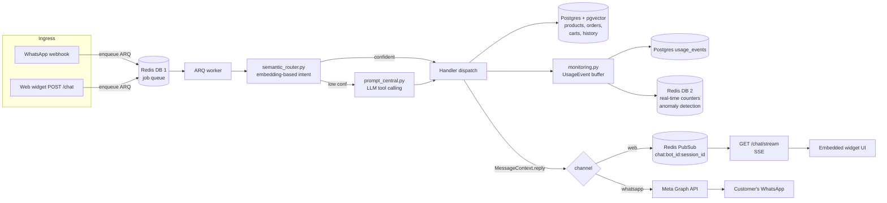

# ZenBotZ — AI Engineering Case Study

> Production-grade restaurant ordering chatbot. Custom semantic intent
> routing → tool-calling LLM → channel-agnostic pipeline serving web
> widget today, WhatsApp on the way. Built end-to-end: prompts, eval,
> infra, observability, unit economics.

**Live demo:** **[chat with the bot →](https://dev-api.zenbotz.com.br/demo)** · [conversation eval gallery →](https://dev.zenbotz.com.br/eval)

> ⏰ The interactive widget runs on the cost-optimized dev environment, scheduled
> **on weekdays ~9 AM–7 PM (BRT / UTC-3)**; it scales to zero off-hours and
> weekends. The **[eval gallery →](https://dev.zenbotz.com.br/eval)** stays up
> around the clock (cached real conversation traces), and the GIF below shows the
> full live flow regardless of the clock.

<!-- TODO: record and embed demo GIF here. Suggested capture:
     customer orders in the web widget → order appears live on the SSE
     kitchen-display board → PIX QR generated. Save as .github/media/demo.gif
     (docs/ is gitignored, so a GIF there would NOT render on GitHub)
     and replace this comment with:  -->
_Demo recording: **GIF coming here** — see the TODO in this file's source._

**Status:** dev environment running on AWS · 442 automated tests ·
~79% corpus QA comprehension · ~$0.001 per real customer conversation.

---

## What it does

A restaurant pastes a `<script>` tag on its site (or, later, connects a
WhatsApp Business number) and customers can order through natural-language
chat: add items, ask for suggestions, change quantities, finalize delivery,
generate a PIX payment QR. The bot is in production-grade Portuguese with
voice-note support.

A multi-tenant dashboard lets each restaurant edit its menu, watch live
orders (SSE-driven KDS), and inspect per-message cost.

## Why it's interesting (for an AI engineer hire decision)

Most "I built a chatbot" portfolios are LangChain wrappers around
`chat.completions.create`. This one is the opposite — a deliberate
production system with the engineering tradeoffs visible:

| Capability | Where to look |
|---|---|
| **Custom 3-tier semantic intent router** — embedding similarity classifies ~85% of messages *before* an LLM is called | [`app/semantic_router.py`](app/semantic_router.py) |
| **4-layer retrieval** — ILIKE → keyword match → description match → pgvector cosine. Embeddings are the *last* resort, not the first. | [`app/crud.py`](app/crud.py) `find_relevant_products` |
| **Tool-calling with Pydantic-validated arguments** — LLM output is parsed against typed schemas before any DB write | [`app/tool_arg_schemas.py`](app/tool_arg_schemas.py), [`app/prompt_central.py`](app/prompt_central.py) |
| **Per-call cost tracking + anomaly detection** — every external API call writes a `UsageEvent` (tokens, USD, latency, trace_id). 3× rolling-average → warning, 10× → critical | [`app/monitoring.py`](app/monitoring.py) |
| **Channel isolation contract** — one core pipeline (`MessageContext.reply()`) serves WhatsApp and the web widget. New channels plug in at three well-defined seams. | [`plan/in_browser_bots.md`](plan/in_browser_bots.md) §"Channel Isolation Contract" |
| **Voice with provider redundancy** — Groq Whisper-large-v3-turbo primary, OpenAI Whisper-1 fallback. Conditioning prompt built from the bot's product catalog. | [`app/openai_client.py`](app/openai_client.py) `transcribe_audio` |
| **Eval corpus + comprehension scoring** — 442 automated tests + a separate QA corpus that scores end-to-end conversation understanding | [`tests/simulation/corpus/`](tests/simulation/corpus/) |
| **Cost engineering** — tracked plan to cut LLM spend 30-50% via fine-tuning + model alternatives, with measured baseline | [`tech_debt/backlog_token_reduction.md`](tech_debt/backlog_token_reduction.md) |
| **Structured logging + trace correlation** — every WhatsApp/web message gets a 12-char `trace_id` propagated through logs and into `usage_events.trace_id` | [`app/logging_config.py`](app/logging_config.py), [`app/context.py`](app/context.py) |
| **Real IaC on AWS** — 95 Terraform resources across 17 modules; ARM64 Graviton on Fargate Spot for ~$20/mo dev cost floor | [`infra/`](infra/) |

For the recruiter-friendly cheat sheet with explicit interview talking
points, see [`PORTFOLIO.md`](PORTFOLIO.md).

## Architecture (one-pager)



## Tech stack

**Backend** — Python 3.10 · FastAPI · SQLModel (async SQLAlchemy 2) ·
ARQ workers · Postgres 14 + pgvector · Redis 7 · OpenAI gpt-4o-mini ·
Groq Whisper · Mercado Pago.

**Frontend** — Next.js 16 · React 19 · TanStack Query · TypeScript · Tailwind.

**Infra** — AWS ECS Fargate (Graviton ARM64) · RDS · ElastiCache · S3 ·
ALB · Route 53 · Terraform · GitHub Actions · CloudWatch.

## Quickstart

```bash
git clone <repo>
cd zenbots
cp .env.example .env  # add your OPENAI_API_KEY at minimum

# Boot the full stack: backend + worker + Postgres + Redis + MailHog
docker compose up --build

# Hit the health check
curl http://localhost:8000/health/ready

# Open the dashboard
open http://localhost:3000
```

Migrations run automatically on backend boot. See
[`docs/restart_espec.md`](docs/restart_espec.md) for which services to
restart after which kinds of code change.

## Numbers worth knowing

- **442 automated tests**, ~55% coverage, currently ~9 failing locally
  on Python 3.14 (bcrypt compat); CI uses 3.10 and is green.
- **~79% comprehension** on the QA corpus (custom ground-truth eval).
- **~$0.001 per conversation** measured at the per-call layer
  (gpt-4o-mini, 3-4k input + 150 output tokens).
- **~$2,800/month** projected LLM spend at 1,000 active restaurants.
- **~$20/month** dev infra cost floor (ECS scheduled scale-to-zero
  off-hours, fck-nat instead of managed NAT Gateway, SSM instead of
  Secrets Manager).

## Project layout

```
app/                  FastAPI app + ARQ worker + AI pipeline
  semantic_router.py    3-tier intent classification (no LLM unless needed)
  prompt_central.py     LLM tool-calling system + few-shot prompts
  tool_arg_schemas.py   Pydantic schemas validating every LLM tool call
  monitoring.py         Per-call cost + token + latency tracking
  whatsapp.py           Channel-agnostic message pipeline
  web_channel.py        Web widget egress (Redis PubSub → SSE)
  chat_routes.py        Web widget HTTP endpoints
  crud.py               4-layer product retrieval (ILIKE → vector)

tests/
  simulation/corpus/    QA harness with ground-truth conversations
  test_*.py             Unit + integration tests (~442 total)

plan/                 Active engineering plans (current work + roadmap)
tech_debt/            Tracked backlogs (architecture, security, perf, cost)
docs/                 Architecture, observability, AWS, runbook
infra/                Terraform — 95 resources, 17 modules
```

## License

MIT.

## Reach me

João Ribeiro — `joaoottavioc@gmail.com`. Open to AI engineer roles. See
[`PORTFOLIO.md`](PORTFOLIO.md) for the engineering case study.
